# Ferramentas auxiliares no aprendizado de línguas {-} 

Nas seções e páginas a seguir será abordado o uso de aplicativos como ferramentas de suporte no aprendizado de línguas, _sobretudo o Anki_. O Anki é uma ferramenta muito útil para amplificar o nosso vocabulário na nossa L2. Ele pode ser tanto um auxiliar como ele pode ser prescindível, e isso depende tanto do seu estilo quanto da língua que você está aprendendo. 

Se a sua L2 é grego ou árabe, você vai precisar acumular um certo número de palavras para _começar_ a entender o que tá acontecendo no seu conteúdo de imersão. Pode ser que você precise aprender algo como as 500 a 1000 palavras mais comuns do idioma antes de começar "engatar" de fato. Não recomendo, entretanto, que você deixe para praticar imersão apenas _após_ ter aprendido tantas palavras. A imersão pode ser frustrante, principalmente no início, mas mesmo com pouco vocabulário é possível tirarmos proveito dela.

Se a sua L2 é algo mais parecido com o Português, como Espanhol ou Italiano, o Anki já aquire características mais auxiliares. Já não é necessário utilizá-lo como um "preparatório" anterior à imersão: pode-se começar a imersão desde o início, e usar o aplicativo apenas para as palavras mais complicadas.

O uso de tais ferramentas não é para sempre. Um dia você sentirá, por conta própria, que não precisa mais delas.

Será brevemente abordado também o Duolingo. Embora reduzida, sua utilidade existe.

---

## O uso de aplicativos {-}

Aplicativos são úteis, mas a utilidade principal dos aplicativos é uma só: aumentar seu vocabulário. A exceção, óbvio, são os aplicativos em que você conversa com pessoas reais.^[Esses podem ser um pouco perigosos, e eu recomendo que, se você quiser conversar com pessoas na sua L2, sejam eles estranhos, sejam eles professores, que você ou o faça em chats públicos como esses do Discord, ou você pague por um tutor em uma plataforma como o Preply.]

Se a utilidade dos aplicativos é te ajudar a aumentar seu vocabulário, por que perder tempo com um aplicativo como Duolingo? O Duolingo (ou outros aplicativos do mesmo tipo) têm uma utilidade inegável: eles te ajudam a entender _mais ou menos_ as estruturas frasais básicas da língua, mas os resultados vão diminuindo conforme a progressão. Uma outra utilidade, inegável e ao meu ver insuperada, do Duolingo é o aprendizado de sistemas de escrita.

Se você vai usar um aplicativo, você quer então usar um que te forneça o maior custo-benefício. Ao meu ver, estes são os aplicativos voltados para aumentar o seu vocabulário. Os melhores aplicativos desse tipo são os que empregam um _sistema de repetição espaçada_.

## Sistemas de repetição espaçada {-}

O nosso cérebro tende a esquecer coisas por uma questão econômica. O que ele por algum motivo não considera importante, ele esquece. E isso é bom! Entretanto, entre as coisas que ele esquece por mera economia estão aquelas que usamos pouco, mas que mesmo assim gostaríamos de lembrar. Palavras em uma língua estrangeira (ou mesmo na nossa própria), se pouco utilizadas, entram nessa categoria.

Existe uma forma simples de impedir isso de acontecer: lembrar do que não queremos esquecer. Nossa, jura mesmo? É, o princípio é estupidamente simples, mas não é algo que podemos fazer (razoavelmente) se apenas apostarmos na potência das nossas memórias. É necessário então criar um sistema _fora de nós_. Aí nós fazemos anotações, ou criamos outro tipo de ferramenta para nos lembrarmos, bem, do que precisamos lembrar. Costuma-se utilizar para isso flashcards: cartas com uma pergunta ou palavra na frente, e a resposta ou significado da palavra no verso. 

O desafio destas ferramentas é o seguinte: ao ver a palavra (ou pergunta) você é capaz de _lembrar_ do significado dela sem olhar no verso? Se sim, você olha no verso e vê se você lembrou corretamente. Em caso afirmativo, você guarda essa carta pro futuro. Caso você não tenha lembrado, ou tenha lembrado incorretamente, você deixa ela pra rever daqui a alguns minutos.

Porém as línguas têm milhares de palavras. Eu já criei baralhos de flashcards com mais de 6000 cartas! Ficar revendo 6000 cartas por dia não tem nada a ver com bom-senso; eu teria que viver só para aprender línguas. Seria chato, seria infernal. 

Para resolver esse problema foi criado o Anki, um programa de computador ou aplicativo de celular cujo propósito é te ajudar a fazer esse gerenciamento. Assim, enquanto eu tinha 6000 cartas em um baralho que eu usava para estudar russo, eu trabalhava com algo entre 30 a 80 cartas por dia (e isso variava por uma série de fatores). Eu explico como utilizar o Anki [aqui][Sistemas de repetição espaçada].

Você **não deve** se apoiar apenas nos sistemas de repetição espaçada. Na verdade, é possível prescindir deles. Eles podem ser um pouco chatos, mas eles _agilizam_ o processo para nós. Sem eles, demoraria muito mais para adquirirmos a nossa L2 desejada. Todavia, eles sozinhos não bastam. O ideal é utilizá-los _junto_ com a imersão. Se a imersão sem eles é mais lenta quanto ao fornecimento de resultados, usá-los sem a imersão é esforçar-se inutilmente. **Eles são para a imersão**, e portanto não há motivo nenhum para utilizá-los que não seja para aumentar a potência da imersão.

# Anki: primeiros passos

Antes de mais nada, o que é o Anki? 

O Anki é um programa feito pra te ajudar a _memorizar coisas_. As pessoas o utilizam para memorizar poemas, matérias na faculdade (o Anki é muito comum entre estudantes de medicina), teoria e notação musical e -- o nosso caso -- palavras em uma língua estrangeira. 

Ele funciona por meio de flashcards digitais. Como foi dito anteriormente, flashcards são cartas com uma pergunta na frente e sua resposta no verso. Uma exemplo de pergunta na frente pode ser "Qual é o maior músculo da metade inferior do corpo", diante da qual o verso seria o "Glúteo Máximo". No estudo de línguas, o lado da frente da carta poderia ser simplesmente algo como "Actually", diante do qual o verso seria "Na verdade"; frente: "Wreak havoc", verso: "Causar caos; causar destruição". É possível adicionar mais informação além de só uma pergunta, como diretrizes de pronúncia, desenhos, ilustrações ou que quer que seja considerado útil.


Mas isso pode ser muito trabalhoso de fazer à mão, e por conta disso o Anki foi desenvolvido para alavancar o mundo digital em benefício desta tarefa.

Os próximos três capítulos são dedicados ao aprendizado do Anki em três etapas:

1. O básico do Anki;
	- Aprendermos qual é a lógica por trás desse programa;
	- Aprenderemos a sincronizar o Anki no computador e no smartphone, para que possamos cumprir com os nossos objetivos de estudo onde quer que estejamos.
2. Como inserir plugins 
	- Instalaremos um plugin que pode nos ajudar a aprender a pronúncia correta das palavras;
3. Como criar novos tipos de carta e editar a aparência do Anki.
	- Veremos como criar cartas mais elaboradas;
	- Veremos como alterar a aparência dessas cartas para fins estéticos.

Você não precisa aprender tudo de uma vez para começar a usar o Anki: apenas a primeira parte basta. Contudo, eu recomendo que você vá pelo menos até a segunda, pois ela é extremamente útil.

A terceira parte serve para você que quer organizar melhor suas cartas e/ou alterar a aparência delas. A parte da alteração da aparência é um tanto técnica e não será abordada ao fundo, pois ela envolve o uso de HTML e CSS, que estão fora do escopo deste site. Contudo, forneço uma referência para quem quiser aprender o básico dessas tecnologias.

Estes capítulos foram criados tendo em mente pessoas que não possuem elevado grau de fluidez com computadores, e portanto eles são _consideravelmente_ detalhados.

Vamos agora à prática.

----

A primeira coisa que é necessária é fazer o download do Anki. Isso pode ser feito tanto em um smartphone quanto em um computador. O Anki pode ser utilizado em qualquer um dos dois e é possível criar uma conta no [](https://ankiweb.net/) para sincronizar os dois aparelhos, de modo que você possa retomar no celular o que você começou no computador e vice-versa.

Embora ele possa ser utilizado em qualquer aparelho, algumas coisas ou são tornadas mais fáceis com o uso do computador, ou necessitam dele para sem realizadas. Por conta disso, começaremos falando dos computadores.

## Utilizando o Anki no computador 

### Instalação

É necessário antes de mais nada falar o download do Anki. Isso pode ser feito pelo site, https://apps.ankiweb.net/. Logo ao entrar no site você vai se deparar com um grande botão azul em que está escrito "Download". 

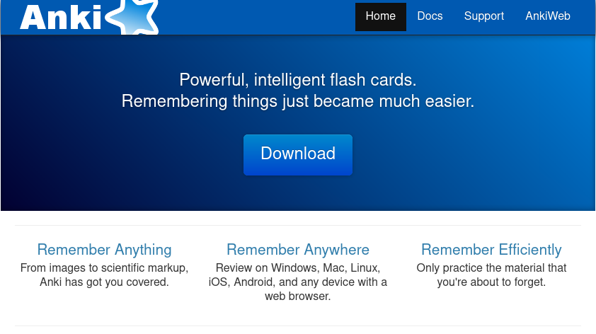

Ao clicar nesse botão, você será levado para uma área da página com várias opções para download. O site provavelmente conseguirá discernir qual sistema operacional você está utilizando (se Windows, Mac ou Linux). 

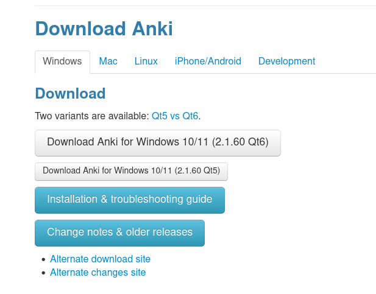

Clique no primeiro ou segundo botão e baixe uma das versões. A diferença entre Qt5 e Qt6 é majoritariamente técnica^[Qt é o conjunto de ferramentas utilizados pelos desenvolvedores do Anki para elaborar a interface gráfica do programa. A diferença entre esses pacotes é relevante apenas para quem utiliza certos plugins extras (que não serão abordados aqui), ou para quem os desenvolve.] e (pelo menos neste momento) não diferença qual você escolhe.

Após ter feito o download do programa, abra o arquivo que você baixou e siga a instalação normalmente.(**detalhar mais essa parte**)

## O menu de baralhos 

Ao abri-lo, você verá algo que se parecerá mais ou menos com isso:

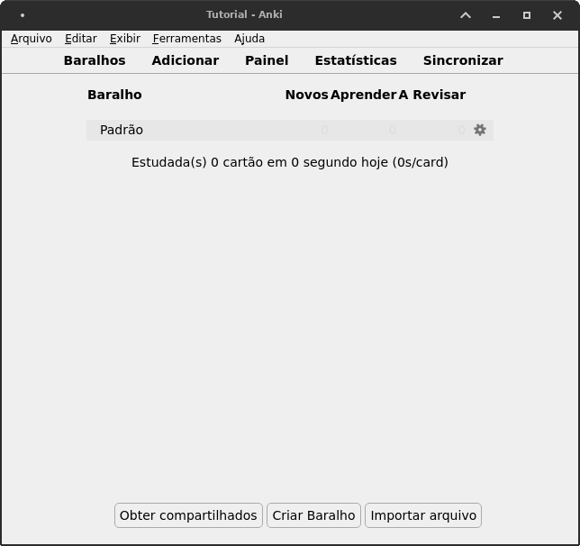

Em cima você tem uma `barra de menu` em que se lê: "Arquivo", "Editar", "Exibir", "Ferramentas", "Ajuda". Vamos abordar este apenas quando formos trabalhar com customizações mais detalhadas das nossas cartas.

Logo abaixo há um menu com cinco opções: "Baralhos", "Adicionar", "Painel", "Estatísticas" e "Sincronizar". O menu "**Baralhos**" é onde você está agora. Não veremos com detalhes cada um deles -- você pode explorá-los por conta própria -- mas nos debruçaremos sobre alguns.

Em "**Adicionar**" nós podemos adicionar novas cartas". Trabalharemos neste adiante. 

Em "**Painel**" nós podemos ver todas as cartas criadas. Podemos também efetuar modificações sobre elas, excluí-las ou utilizar plugins que façam alterações em massa em nossas cartas. Vamos abordar este menu quando formos utilizar o plugin _AwesomeTTS_ para adicionar som às nossas cartas de forma automatizada.

Em "**Estatísticas**" é possível ver o nosso progresso, e ver um relatório da forma como utilizamos o Anki: nossa assiduidade em usá-lo;  previsões acerca do tempo que levaremos para terminar um (ou todos os) baralho(s) em função da nossa frequência de estudo; quantas cartas faltam, quantas são fáceis e quantas são difíceis, e outras coisas. Se você nunca utilizou o Anki, esta área provavelmente estará vazia.

No menu "**Sincronizar**" você será convidado a fazer uma conta do AnkiWeb. Recomendo registrar-se. A utilidade em fazer isso é poder ter o mesmo material, no mesmo estado, tanto no seu atual computador como em outros computadores e também em smartphones. Isso elimina a redundância de ter que estudar a mesma coisa mais vezes do que o necessário, caso você utilize aparelhos diferentes.

### Baralhos 

O Anki não é um programa como o Duolingo, em que você já tem um "curso" pronto para você. Aqui você monta o seu material. Por isso você pode ver um Baralho chamado _Padrão_, que está vazio. Se você clicar nele você será recebido com uma mensagem que diz "Parabéns! Você terminou este baralho por enquanto", o que é um pouco fora do tom, já que ele está vazio.

Mas você pode adicionar coisas a ele ou pode, olhando para o menu na parte inferior da tela, clicar em `Criar baralho` para criar um novo. Deste modo você pode organizar baralhos por tema da forma que você achar mais conveniente. Logo logo veremos como fazer isso.

Há duas opções ao lado de `Criar baralho`: "Obter compartilhados" e "Importar arquivo". Ao clicar na primeira você será levado a uma página no AnkiWeb em que as pessoas compartilham os baralhos que elas criam, e lá você pode procurar pelo tipo de coisa que chama a sua atenção. Se pesquisarmos, por exemplo, por "Inglês", poderemos encontrar algo assim:

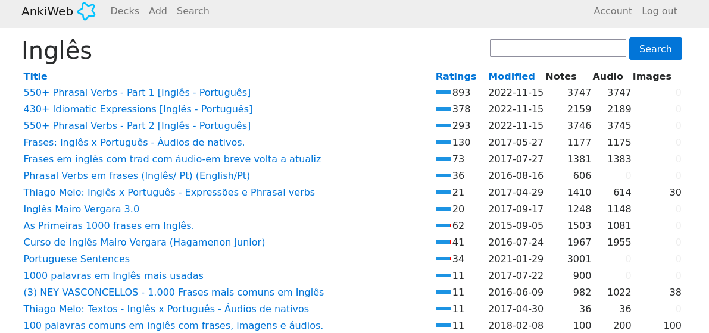

Se você clicar em qualquer um desses decks, ao rolar para baixo você encontrará o botão para Download:

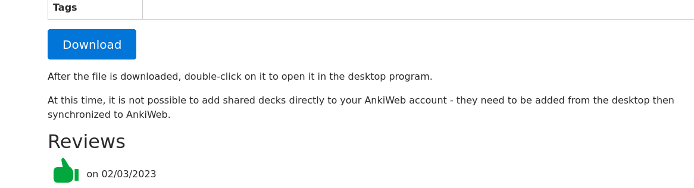

É aqui que entra a utilidade do outro botão, `Importar arquivo`. Nele você pode importar os baralhos que você baixa pela Internet, ou pode importar arquivos `.csv` contendo as cartas que você quer criar. Trabalharemos adiante.

## Adicionar: Criando cartas 

Você pode explorar baixar um baralho qualquer, ou criar o seu próprio. Há grande vantagem em baixar baralhos prontos: eles nos poupam de um grande trabalho -- criar baralhos à mão leva tempo.

Contudo, há uma grande vantagem em criar seus baralhos por conta própria: eles refletem os seus interesses e a sua própria jornada ao longo da língua. Se você gosta de psicologia, você utilizará cotidianamente palavras diferentes das que utilizarão um economista, e vice-versa.

No início pode ser útil aprender as palavras mais comuns. Convém utilizar um baralho pronto com esse conteúdo e ir gradualmente adicionando as palavras que refletem nossas jornadas individuais. Para facilitar este propósito, ofereço [o conjunto de decks que eu elaborei][Apoie este projeto], que vão das 500 às 2000 palavras mais comuns, _excluindo cognatos verdadeiros_ (você não precisa que o Anki te diga que a tradução de "Justice" é "Justiça", nem que a de "Constitution" é "Constituição") ^[há falsos cognatos, entretanto, como "Actually", que **não** quer dizer "Atualmente", mas sim "Na verdade"].

Dito isso, vamos aprender agora como elaborar nossas próprias cartas.

----

Há duas formas de criar cartas: dentro do Anki (processo mais lento, mas mais controlado) e por meio de planilhas. Acredito que o segundo é mais conveniente e confortável, mas, para nos familiarizarmos mais com a interface do Anki, comecemos com o primeiro.

### Criando cartas pelo Anki

Ao clicar em "Adicionar", você se deparará com a seguinte tela:

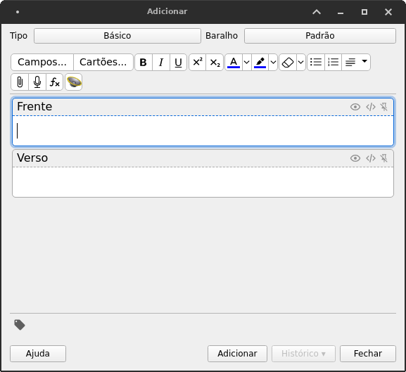

Na parte superior você pode ver o `Tipo`, que provavelmente está como "Básico" e também o `Baralho`. O `Tipo` "Básico" de cartas tem o que você vê no centro da tela -- dois campos: `Frente` e `Verso`.  É possível adicionar mais campos para incluir coisas como imagens, áudio, exemplos de frases em que a palavra é contextualizada etc. Nós aprenderemos a editar e criar os `Tipos` de baralhos no capítulo [Anki: customização de baralhos].

Ao clicar em um desses campos, `Frente` ou `Verso`, é habilitado o editor de texto. Você pode adiconar negrito, itálico, mudar as clores das palavras, adicionar tags em HTML, fazer listas, importar imagens, gravar áudio. Após criar a frente e o verso da carta, clique em "Adicionar" na parte inferior do menu. 

Os campos foram esvaziados, mas sua carta foi criada. Para ilustrar o exemplo, vou criar seis cartas:

- Actually: na verdade
- Tough: duro, difícil
- Thought: pensei, pensou, pensam, pensa; pensamento
- Though: entretanto; a despeito de
- Through: através
- Thorough: completamente; completo; rigoroso

Os exemplos são simplificados; algumas dessas palavras possuem mais significados. Para "aumentar" o tamanho de um dos campos, basta apertar a tecla `Enter` no teclado que ele se ajusta.

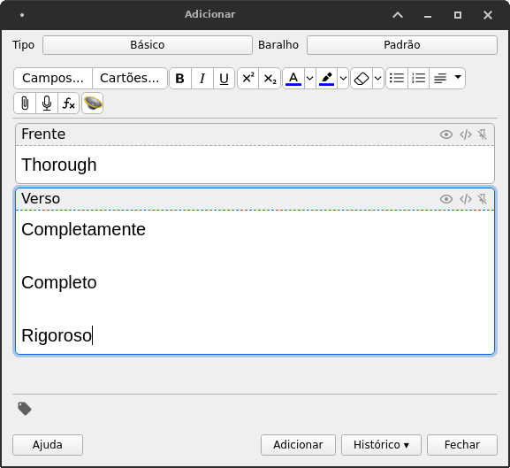

Não se preocupe em fazer os flashcards com perfeição. Eles são importantes, mas o mais importante é a imersão -- lembre-se disso. Vale a pena investir tempo, entretanto, em construí-los, principalmente quando nós sabemos que elas podem nos ajudar a cumprir um objetivo de curto prazo -- lembre-se da importância de elaborar objetivos, trabalhada no capítulo sobre [][A motivação]. Tratarei mais acerca disso em [Diretrizes para elaborar flashcards].

----

Ao ter criado as cartas, você verá que agora há um número (aqui são seis, pois criei seis cartas) ao lado do baralho "Padrão" (que foi o que eu selecionei; pode ser diferente para você, caso tenha criado outro ou baixado um do AnkiWeb), sob a coluna "Novos". Clicando no baralho, veremos a seguinte tela:

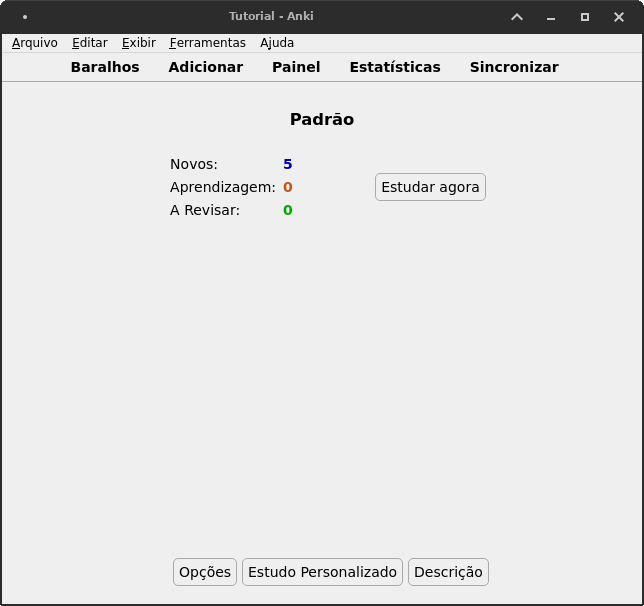

Vamos desmembrar o que significa essa tela:

- São seis novas cartas que estão previstas para serem estudadas hoje. Se eu tivesse um baralho com 6000 cartas, o Anki não me imporia tudo no mesmo dia: ele me passaria um número pré-definido (por mim) de cartas. 
- Há 0 cartas marcadas como "Aprendizagem". Estas são as cartas que eu errei ou que ainda não acertei ao menos duas vezes seguidas hoje.
- Há 0 cartas marcadas como "A Revisar". Estas são as cartas que eu acertei ao menos duas vezes seguidas no passado.

O Anki é um sistema de repetição espçada. Ele foi elaborado para nos ajudar a dar conta de grandes quantidades de informação que precisam ser memorizadas. Se eu tivesse 6000 cartas em um baralho, eu não deveria ter que revisá-las todos os dias. 

O Anki percebe, pela forma como estudamos, quais cartas são mais fáceis e quais são mais difíceis para nós. Às cartas mais fáceis são atribuídos intervalos maiores. Assim, você pode ter 10 cartas para aprender hoje, 30 para revisar hoje, e o restante das 6000 cartas espalhadas em um intervalo de 2 anos. As que você erra mais serão apresentadas mais cedo (hoje ou amanhã) e as que você acerta sucessivamente ganham intervalos cada vez maiores: 2 dias, 5 dias, 11 dias, 3 semanas, 1 mês e meio, três meses, seis, um ano, dois, e assim por diante. Deste modo, é perfeitamente concebível dar conta de um baralho com 6000 cartas ou mais.

Recomendo começar com 10 cartas novas por dia. Para configurar o Anki deste modo, clique em `Opções` na parte inferior da . Você verá um campo denominado "Novos cartões/dia". Mude de 20 para 10 e clique em `Salvar`.

Agora vamos clicar em `Estudar agora`.

----

Você será recebido com a primeira carta que você criou. Na imagem abaixo podemos ver a frente da carta "Tough".

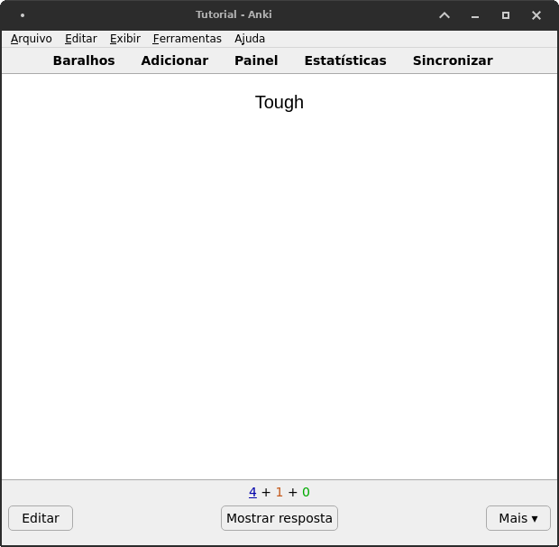

O que você pode ver a princípio é apenas a palavra-desafio. Essa tela te pergunta o seguinte: _o que significa "tough"?_

O que você quer fazer é _tentar lembrar_, ou ao menos adivinhar, utilizando o conhecimento que você já tem. Tendo conseguido fazer isso ou não, clique em `Mostrar resposta`.

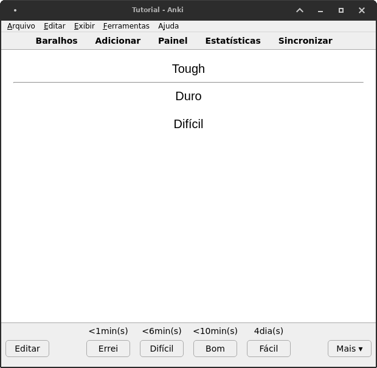 

Agora você vê a resposta, logo abaixo da pergunta. O painel em que você clicou em `Mostrar resposta` agora mudou. Há quatro opções agora: `Errei`, `Difícil`, `Bom` e `Fácil`. Cada uma delas com um intervalo de tempo: _<1min(s), <6min(s), < 10min(s), 4dia(s)_. Cada uma delas representa o intervalo entre a o clique nesta opção e a próxima vez em que você terá que revisar esta carta. 

Se eu clico em "Bom", "Difícil" ou "Errei", você verá o número de cartas marcadas como "Aprendizagem" aumentar: este é o significado do número vermelho acima de "Mostrar resposta". O número azul são as que ainda terei que aprender, e o número verde são as que terei que terei que revisar em decorrência de estudos futuros.

A menos que você altere as configurações do Anki, os intervalos vão todos mudando, com exceção do "Errei". A lógica é a seguinte:

- Fácil: acrescentar intervalo longo até a próxima revisão desta carta
- Bom: acrescentar intervalo normal
- Difícil: acrescentar intervalo curto
- Errei: zerar intervalo; revisá-la daqui a um minuto ou pouco mais.

De modo que mesmo a carta "Difícil" pode ser revisada apenas daqui a um mês, dependendo da sua frequência e qualidade de estudo.

A ideia é que você responda **com sinceridade**. Mentir para o Anki é mentir para si mesmo. Assim, clique em Fácil se você acha fácil, clique em Bom se estiver tudo ok, em Difícil se você achou difícil mas acertou, e em Errei caso tenha errado ou não tenha conseguido se lembrar.

Faça isso com todas as cartas do dia. Ao abrir o Anki novamente amanhã (pois utilizar o Anki deve ser um hábito diário), você verá que o número verde (A Revisar) corresponderá às cartas que você estudou ontem.

----

A aparência das cartas do Anki pode ser... simples demais. É possível customizá-la para torná-la mais rica. Vamos ver como fazer isso em [Anki: customização de baralhos].

## Criando cartas em planilhas

Uma forma mais rápida de criar múltiplas cartas de uma só vez é usando um programa de edição de planilhas como o Microsoft Excel, LibreOffice Calc ou Google Sheets. Por motivos de acessibilidade, usarei aqui o Google Sheets.

Mas antes de criar as cartas, é necessário considerarmos _que tipo_ de carta nós vamos criar. É necessário pensar no que haverá nessas cartas.

No menu "Adicionar" do Anki, você pode ver a possibilidade de escolher o `Tipo` de carta. O `Tipo` Básico só tem dois campos: "Frente" e "Verso". 

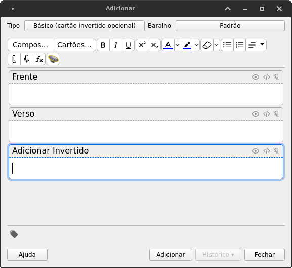

Se você clicar no nome do `Tipo` e escolher a opção "Básico (cartão invertido opcional)", você verá um cartão com _três_ campos. Mais para frente veremos como criar um cartão com quantos campos for necessário. A relevância disso para nós agora, entretanto, é uma: a nossa planilha deve corresponder ao `Tipo` da nossa carta. Se ele tem dois campos, ela deve ter duas colunas.

Vamos ver como fazer isso no Google Sheets. O procedimento é o mesmo em qualquer outro editor de planilhas -- usarei este por ser o mais acessível.  Caso queira acompanhar, basta ir em https://sheets.google.com e clicar em "Branco" (se você já tem uma conta no Google) para abrir uma planilha nova.

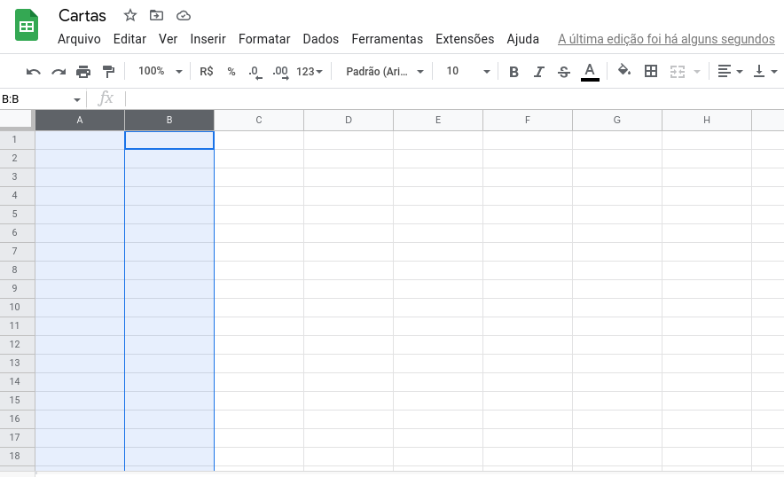

Como o nosso baralho do `Tipo` "Básico" tem apenas duas colunas, vamos utilizar apenas as colunas A e B -- destacadas em azul na imagem acima -- para montar nossas cartas.

A vantagem de utilizar uma planilha em vez de utilizar a própria interface do Anki é que planilhas são mais navegáveis. Pode-se preencher os campos da planilha mais rapidamente utilizando atalhos do teclado do que se pode fazer dentro do próprio programa de flashcards. Apertando "Tab" no teclado nós podemos ir para a célula à direita da atual (e "Shift+Tab" para ir para a célula À esquerda); apertando "Enter" nós podemos mover o cursor uma célula para baixo, e "Shift+Enter" faz o movimento inverso. Nós precisamos coletar os dados que nos são necessários até que tenhamos algo mais ou menos assim:

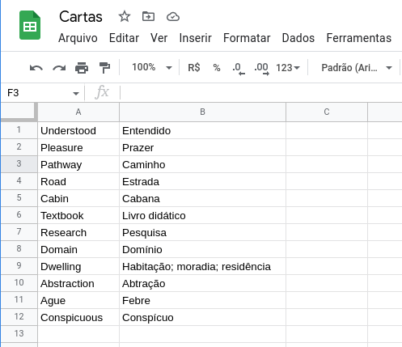

Quando obtivermos isso, precisamos baixar a planilha, ou salvá-la em formato `.csv`. No Google Sheets, isso pode ser feito clicando em "Arquivo" (na barra de menu na parte superior da tela), "Fazer download" e então "Valores separados por vírgula (.csv)": 

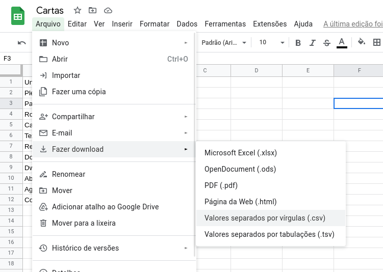

Basta então abrir o Anki e `Importar Arquivo`, o que pode ser feito pelo botão de mesmo nome na parte inferior do menu "Baralhos" ou então clicando em "Arquivos" (na barra de menu, na parte superior da tela) e então em "Importar".

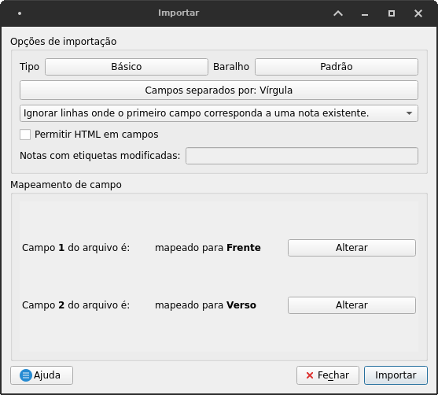

Eis a importância de fazer as colunas das planilhas coincidirem com os campos do seu baralho. A primeira coluna corresponde à "Frente" e a segunda coluna corresponde ao "Verso". Na seção sobre [customização de baralhos][Anki: customização de baralhos] nós veremos como usar isso ao nosso favor, mas a princípio o necessário é simples: manter o `Tipo` como "Básico" e escolher o `Baralho` em que desejamos inserir estas cartas.

Ao utilizar a interface do próprio Anki para adicionar as cartas, nós podemos usar o editor de texto interno para deixar as palavras em negrito, itálico e coisa do tipo. Nós também podemos fazer isso aqui, mas precisamos marcar a opção "Permitir HTML em campos", e inserirmos o HTML manualmente nas nossas planilhas. Veremos isso também na seção sobre [customização de baralhos][Anki: customização de baralhos].

---

Planilhas são mais convenientes. Você pode preenchê-las no computador ou no celular, ao passo que utilizar o aplicativo do Anki para smartphones para adicionar cartas não é tão prático. Além disso, você pode simplesmente ir acumulando apenas uma parte das cartas, em vez de ser obrigado a preencher os dois campos de uma vez só, e ir preenchendo o restante conforme necessidade. 

Por exemplo, imagine que você esteja aprendendo alemão para estudar filosofia. Existe um certo número de palavras que você conhece na sua língua, mas que desconhece no alemão, que você quer aprender. Neste caso, você pode ir coletando essas palavras aos poucos, no seu tempo, e quando você julgar pertinente você vai atrás do significado delas para então importá-las para o Anki. Neste meio tempo, você vai apenas colecionando os campos do "Verso":

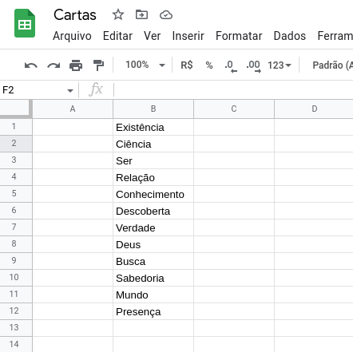

Por outro lado, digamos que você tenha assistido uma peça francesa e percebido várias palavras que se repetem, mas não conseguiu ainda pegar o significado delas. Neste caso, você vai apenas coletando, no seu ritmo, as palavras do campo da "Frente", e preenche o "Verso" quando julgar pertinente:

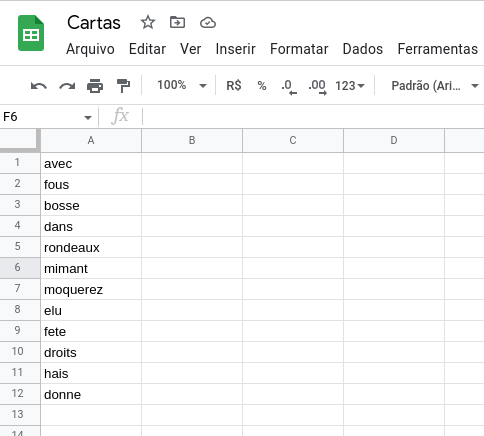

(Inspirado no vídeo "[Le pape des fous](https://www.youtube.com/watch?v=DYWP5dnLxCM)".)

Eu pessoalmente acho que utilizar uma planilha para montar as cartas é mais conveniente do que a própria interface do Anki. Aqui, você pode fazer as coisas de forma mais cômoda.

## Práticas para elaborar flashcards

Nesta página tem uma coisa que ficou subentendida: é necessário que você pesquise e monte suas próprias cartas. Sim, mesmo que você utilize um baralho disponibilizado online, é interessante que você monte as suas próprias cartas com o tempo. Esses baralhos vão abordar o que é _comum_ na língua. Os [próprios baralhos que eu elaborei] têm como orientação a frequência das palavras na língua.

Mas existe uma diferença entre as palavras mais frequentemente utilizadas na língua _pelas pessoas como um todo_ e há as que são mais frequentes _no seu_ vocabulário. Isso depende das coisas que você considera importantes. Isso vai depender do seu hobby, da sua profissão, dos seus interesses e das suas necessidades.

Se você for aprender em um curso de inglês, você vai aprender as mesmas palavras que todas as outras. A lógica é encontrar _algo de comum_. Veja bem: é importante ter algo de comum, justamente para que você possa compreender o que os outros falam e para que os outros possam te compreender de volta, mas é necessário também cultivar _o que lhe é peculiar_. Se você é um psicólogo, as palavras "mente", "comportamento", "ambiente", "inconsciente", "pesquisa" e outras coisas do tipo vão ser partes importantes e recorrentes do seu vocabulário. Em inglês, as palavras que a estas correspondem, -- "_mind, behavior, environment, unconscious, research_" -- não figuram entre as palavras mais comuns da língua. Esse é o tipo de coisa que você teria que buscar por conta própria.

Claro, você pode ir pela via da insanidade: vou pegar o maior deck que eu encontrar online, digamos, um com 12.000 palavras, e vou aprender todas, na ordem de frequência. Embora eu não ache que isso seja uma má ideia se isso for _parte_ do seu plano, certamente não é uma prática boa se é nisso que consiste todo o seu sistema auxiliar de repetição espaçada.

Ok, como assim? Qual seria a melhor via, então? Exponho: faça paralelamente o seguinte:

1. Aprenda palavras comuns, estabelecidas _por frequência_;
2. Trace um objetivo -- ler um conto, um texto curto; aprender certas palavras que me são importantes; aprender um determinado número de músicas ou poemas, entre outros -- e crie um baralho que te aproxime dele.

Enquanto você rotineiramente aprende as palavras mais comuns, você paralelamente estabelece seus objetivos de curto prazo. Digamos que você queira ler **uma**^[É importante que os objetivos sejam facilmente alcançáveis para manter a motivação, ainda mais considerando que **elaborar flashcards é trabalhoso**. Se você traçar a meta de ler as cem primeiras fábulas de Esopo, isto seria um peso muito grande sobre os ombros. Se você é um dos tipos que gosta de traçar metas grandiosas, talvez seja bom proceder da seguinte forma: aprender as cinco primeiras, depois as próximas cinco, depois as próxima cinco... E assim por diante. Assim você equilibra a tensão entre "buscar" e "alcançar", de modo que não seja tão fácil alcançar (e portanto chato) e nem muito longa a busca (e portanto estressante)] das [Fábulas de Ésopo](https://read.gov/aesop/001.html), o que você poderia fazer é:

1. Dar uma primeira lida (imprimir o texto pode ser útil aqui)
2. Marcar as palavras desconhecidas
3. Anotá-las todas numa planilha
4. Aos poucos, no seu tempo, procurar pelo significado delas
5. Importá-las para o Anki
6. Estudá-las até ter aprendido todas 
7. Reler o texto

Deste modo, você estabelece os ganchos e as metas e então busca por elas. É um  processo bem simples: você aprende as palavras associadas às coisas que são do seu interesse. A chave aqui é o fato de que **elas são do seu interesse**. É importante traçar metas, pois buscá-las e alcançá-las mantém a nossa motivação. A pura imersão e o aprendizado de vocabulário por frequência pode ser muito produtivo, mas acredito que muitos podem se sentir meio "largados" e "jogados" se não tiverem uma forma mais clara de medir o próprio progresso. Estabelecer esse tipo de objetivo é uma dessas formas.

Portanto, é simples: **os flashcards que você monta devem estar associados aos seus objetivos, necessidades e interesses.** Você pode ter múltiplos baralhos, digamos: um com as palavras do seu interesse, um frases interessantes que você tenha visto por aí, um com palavras selecionados por frequência, entre outros. Cuidado para não se sobrecarregar, criando múltiplos baralhos com um alto número de cartas novas por dia. Se você for utilizar múltiplos baralhos, module a quantidade de cartas que são reveladas diariamente -- lembre-se: **o Anki é um esforço diário!** -- para que isso se encaixe na sua rotina e você não fique sobrecarregado.

Não recomendo, entretanto, aprender múltiplas línguas simultaneamente se a sua intenção for alcançar um nível de compreensão e expressão avançados em ambas as línguas. O motivo disso é simples: aprender uma língua só é trabalho o suficiente, e exige esforço. Aprender duas ou mais ao mesmo tempo apenas resultaria numa difusão dos nossos esforços, o que pode nos deixar sobrecarregados e/ou fazer com que tenhamos um progresso mais lento. Todavia, se um progresso mais lento não for um problema para você, ou se você não quer exatamente "alcançar" um nível de expressão ou compreensão, mas apenas aprender um ou mais textos (digamos, aprender a letra do Ode à Alegria de Beethoven em alemão e alguns poemas em francês), não há por que se preocupar com isso.

## Utilizando o Anki pelo celular

Para encerrar esta sessão, vou abordar como empregar esse sistema auxiliar para uso em um smartphone. Se você usa Android, o Anki pode ser baixado gratuitamente pelo nome de _AnkiDroid_ na [Play Store](https://play.google.com/store/apps/details?id=com.ichi2.anki). Entretanto, se você usa iOS, será necessário comprar o aplicativo _AnkiMobile_ na [App Store](https://apps.apple.com/us/app/ankimobile-flashcards/id373493387). Uma alternativa para os usuários de iPhone que não querem pagar é acessar o AnkiWeb pelo navegador e fazer os seus estudos por lá -- menos confortável, mas certamente válido.

Eu penso que o Anki deve ser utilizado no celular para o simples fim de **estudar com comodidade**: na cama, no transporte público, no sofá -- onde quer que se possa usar o celular tranquilamente. Deste modo não precisamos nos deslocar para o computador para dar cabo na nossa cota diária de estudo.

Dito isso, não acho que o Anki em sua versão _mobile_ deve ser utilizado para _criar cartas_. Ele não é comodo para esse propósito. Claro, você pode, mas eu recomendo altamente que você deixe para fazer isso no computador se for possível. De qualquer modo, você pode utilizar um aplicativo de planilhas no celular para criar cartas caso esse seja o seu objetivo, e então importá-las para o Anki pela função de importação que também está presente no aplicativo. Porém, a versão _mobile_ do Anki não tem a capacidade de utilizar _plugins_ como o AwesomeTTS (que veremos na próxima página), o que de fato o faz figurar especialmente não como um programa para criação de material, mas sim como um para estudá-lo.

Vou utilizar o AnkiDroid como exemplo. 

A lógica interna do AnkiDroid é a mesma que a do Anki para computador: você tem os seus baralhos com as suas cartas, e você as marca de acordo com quão fácil ou difícil você as considera. Abaixo há uma imagem de uma carta criada para estudo do francês, com campos extras, áudio e exemplos da frase em contexto. 

{width=30%}

Mas o importante aqui é que essa carta não foi criada no AnkiDroid, mas no computador, o qual foi _sincronizado_ com o AnkiDroid pela nuvem. É aqui que ele brilha de verdade. Para sincronizar é necessário ter uma conta no AnkiWeb, que pode ser criada de forma simple -- algo que você talvez já tenha feito --. Para entrar ou criar na conta, basta fazer o seguinte: 

1. Repare no botão de "Sincronizar", com as setas em círculo e um ponto de exclamação vermelho, na parte superior direita da tela.

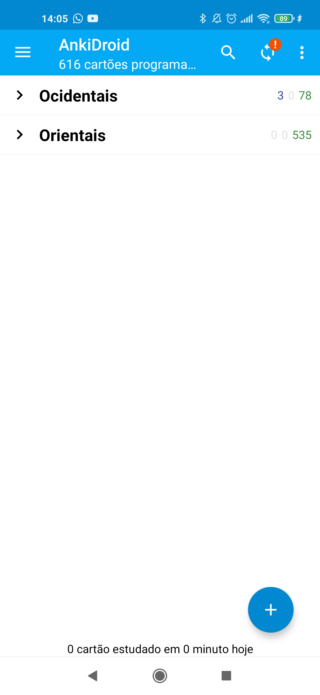{width=30%}

2. O aplicativo pedirá que você faça um login. Clique em "Logar".

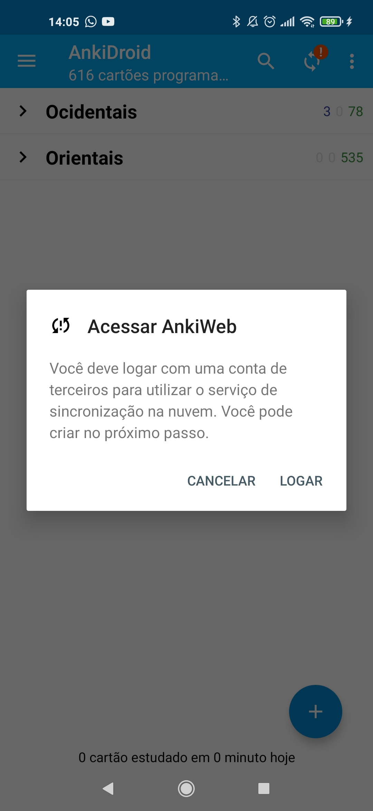{width=30%}

3. Coloque o seu e-mail e senha.

{width=30%}

Caso você não tenha criado uma conta ainda, clicar em "Inscreva-se" e esta tela será aberta.

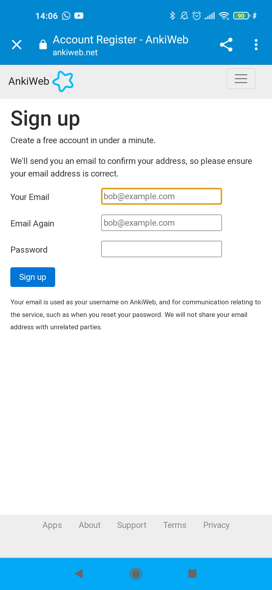{width=30%}

Após ter preenchido com as suas credenciais, basta acessar o seu e-mail e confirmar a conta recém-criada.

Com as mesmas credenciais que você criar nesta tela, você deverá fazer o _login_ tanto no computador quanto no celular. Feito isto, você poderá sincronizar livremente, de modo que você não precisará se preocupar em manter o estudo separadamente. 

O Anki na versão para computador, se você tiver feito o login, sincronizará sempre que você abrir ou fechar o programa. No celular, é necessário sincronizar manualmente, apertando no ícone de sincronização (as setinhas em círculo em que clicamos para fazer o login). É possível habilitar a sincronização automática no menu de configurações, fazendo o seguinte:

1. Apertar as três barras horizontais no canto superior esquerdo da tela;
2. Selecionar o menu "Configurações"
3. Selecionar "AnkiDroid -- Configurações Gerais"
4. Habilitar a "Sincronização automática".

E _voilà!_ Tudo está pronto. Agora sempre você abrir ou fechar o aplicativo ele efetuará a sincronização. 

**Atenção**: se você não sincronizar sempre que estudar, seja no computador, seja no celular, você pode ter problemas de conflito com o estado do seu baralho. Se houver conflito, você vai ter que apagar um dos estados (ou o que está na Nuvem, ou o que está no aparelho que você está utilizando). Sempre que você sincronizar, o que você acabou de estudar terá ido para a nuvem. Se a última alteração que você tiver feito no seu baralho for a versão que está na nuvem, diante de um tal conflito, selecione "Fazer o Download do AnkiWeb". Se não for -- caso você tenha feito alterações locais que ainda não foram enviadas para a nuvem, e estas forem mais recentes e/ou importantes do que o que está na nuvem -- então selecione "Enviar para o AnkiWeb". Na versão Mobile, ele te perguntará: "qual versão você deseja manter", e então você deverá selecionar _AnkiWeb_ (o que está na nuvem) ou _AnkiDroid_ (a versão local). O estado diferente do que for selecionado será deletado. É necessário cuidado aqui. Para evitar isso, convém habilitar a sincronização automática, como exposto acima.

# Anki: plugins e AwesomeTTS

Já sabendo como adicionar cartas, você ter o interesse de adicionar som a elas. Claro, isso não é exatamente necessário, mas é um auxílio a mais, principalmente se você estiver estudando uma língua que não tenha uma correspondência entre letra e som tão próxima como o português. Em inglês, por exemplo, as palavras "streak", "break" e "steak"^[Elas soam, respectivamente, como "/strik/", "/brêik/" e "/stêik/"] não têm uma sonoridade previsível apesar de serem parecidas na grafia. Assim, ter um auxílio de pronúncia pode vir a calhar.

Adicionar som ao Anki pode ser feito de duas formas:

1. Você pode simplesmente adicionar uma gravação da sua voz (ou da voz de outra pessoa) utilizando as funções de "anexar arquivo" ou de "gravar áudio": 
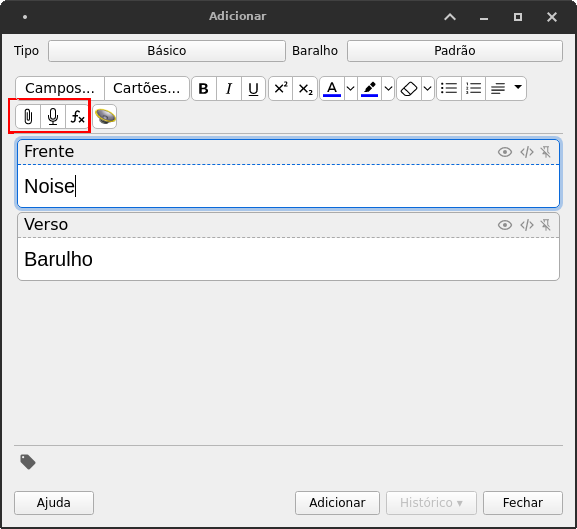{width=30%}

2. Mais convenientemente, você pode usar _plugin_ que emprega serviços como o Google Tradutor para ler em voz alta a palavra (ou frase) desejada. Aqui nós aprenderemos a fazer isso.

## Instalando plugins

O processo de instalação de plugins no Anki é simples. Basta seguir a direção exposta na imagem a seguir:

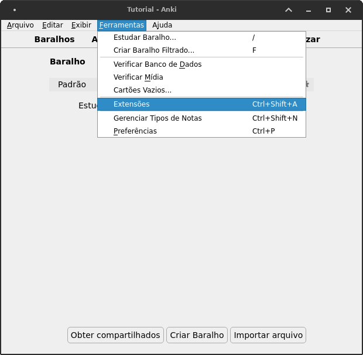

Você será recebido com um menu ao lado de um campo branco. Ao clicar em `Obter extensões`, o programa pedirá de você um código. Se você não sabe qual código inserir, clique em `Explorar Extensões`. Você será levado para um site onde você poderá pesquisar pelos plugins que você deseja.

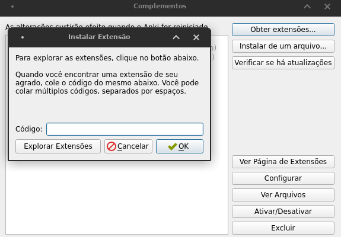

Você será recebido pela seguinte página: 

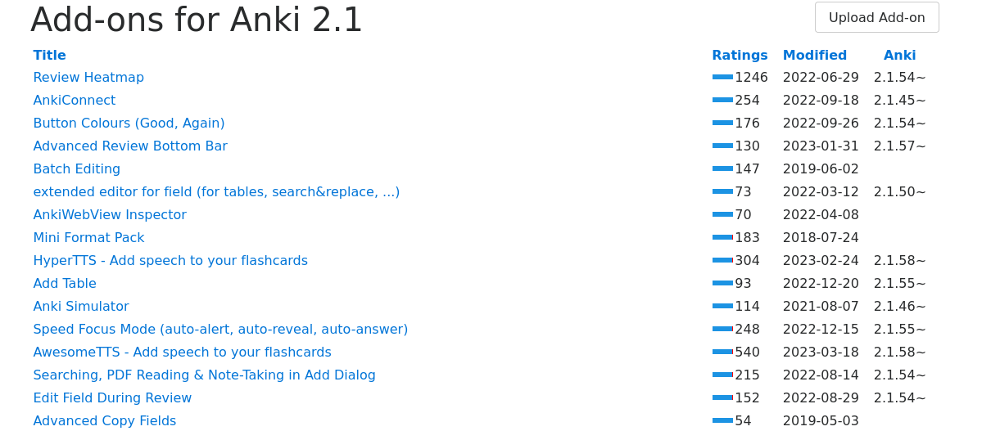

Há duas opções de plugins de inserção de áudio nesta tela: _HyperTTS_ e _AwesomeTTS_. Ambos foram feitos pelo mesmo desenvolvedor, e o HyperTTS é a alternativa mais atualizada. Contudo, embora gratuito, ele exige que o usuário se registre, então em prol da simplicidade e rapidez nós vamos abordar o AwesomeTTS aqui.

Clicando no nome do plugin ("AwesomeTTS") nesta tela, você será levado para a página da extensão. Há várias imagens, descrições, comentários e tudo mais, mas o que você quer é o código numérico na seção "Download", logo antes das "Reviews":

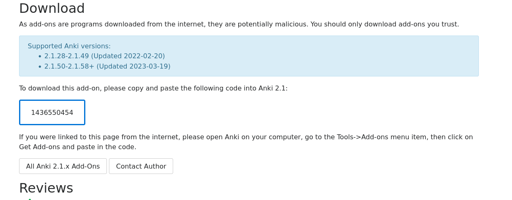

Para facilitar as coisas, o código é este: `1436550454`. Você precisa copiar esse código e inseri-lo no campo que aparece logo após clicarmos em `Obter extensões`.

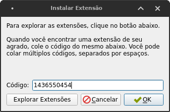

Depois disso, basta clicar em `OK` que o download da extensão será feita. Feito isso, feche o Anki, abra-o de novo e a extensão estará instalada.

Agora veremos como usá-la.

## O menu `Painel`

Para usar o AwesomeTTS de forma eficiente, nós precisamos navegar pelo menu `Painel` do Anki. Basta clicar em `Painel`, no mesmo menu em que se encontra as opções `Baralho`, `Adicionar`, `Estatísticas`e `Sincronizar`.

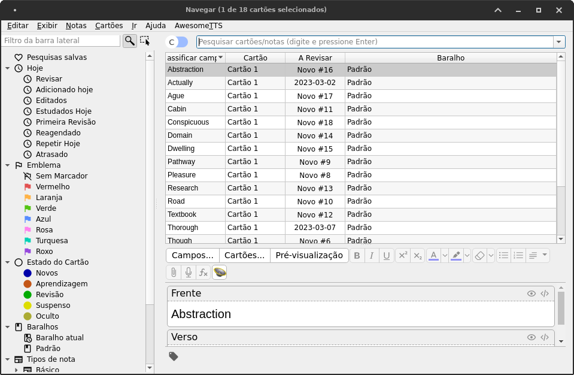

Nesta página há várias coisas que podem ser feitas: pode-se substituir caracteres e expressões em massa (caso você tenha cometido um mesmo erro em todas as suas cartas), editar uma por uma, ver as datas de inclusão e de próxima revisão de cada carta, e assim por diante. Pode-se também ver múltiplos baralhos separados ou em conjunto. 

As cartas marcadas como "Novo" na coluna `A Revisar` ainda não foram estudadas. Você provavelmente vai inserir áudios a novas cartas múltiplas vezes, e você não vai querer adicionar duas ou mais vezes a cartas que já têm áudio. Uma forma de discriminar quais cartas já têm áudio das que não têm é adotar a seguinte estratégia: 

- Adicionar áudio às cartas logo após adicioná-las
- Não adicionar novas cartas até ter terminado de estudar as cartas que você estudou antes.
	- Você pode também simplesmente ir guardando as cartas que você adicionará no futuro em uma planilha e só fazer a adição de fato após já ter estudo pelo menos uma vez as que estão pendentes. Assim você evita postegar a coleta de novas cartas para além do necessário.
	- Alternativamente, você pode criar um baralho separado para as cartas que não têm áudio e após tê-lo adicionado migrá-las para outro baralho; 
- Apenas adicionar áudio a cartas que não estão marcadas como "Novo", ou seja, cartas que já foram estudadas.

Você pode separar as cartas que já foram estudadas das que não foram clicando no nome da coluna "A Revisar". Isso as organizará por data de revisão. Feito isso, você pode selecionar apenas as que estão marcadas como "Novo".

Todavia, neste exemplo nós vamos selecionar todas, pois todas as cartas deste baralho estão sem nenhum arquivo de áudio. Clique na primeira carta, role para o fim da lista com o seu mouse, segure a tecla `Shift` no seu teclado e então clique na última carta. Elas serão todas selecionadas e ficarão marcadas em cinza.

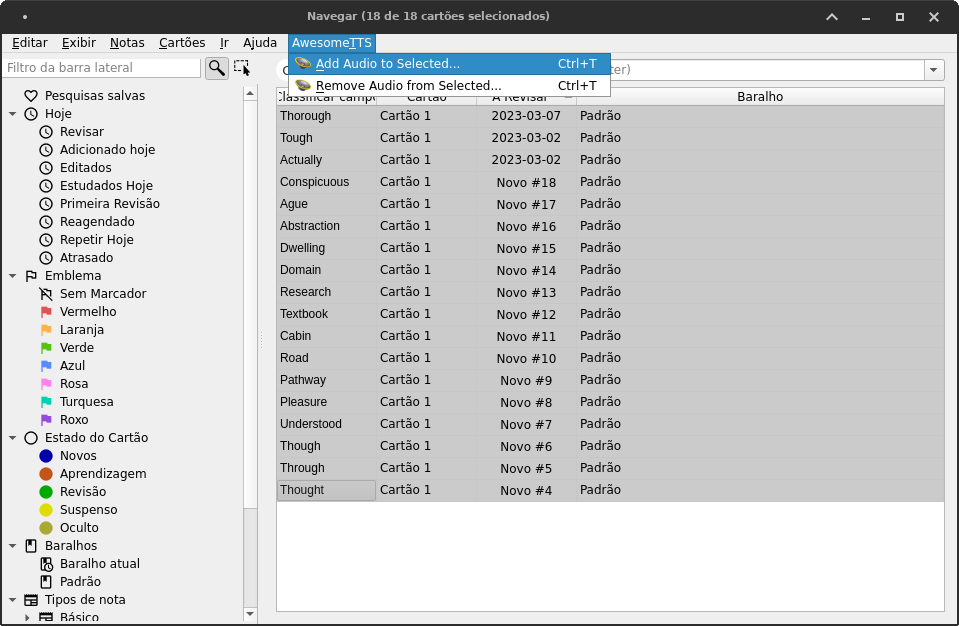

Se você instalou o _AwesomeTTS_, você perceberá que lá em cima todas há um novo menu chamado _AwesomeTTS_. Clique nele e depois em "_Add Audio to Selected_". Você verá o seguinte menu:

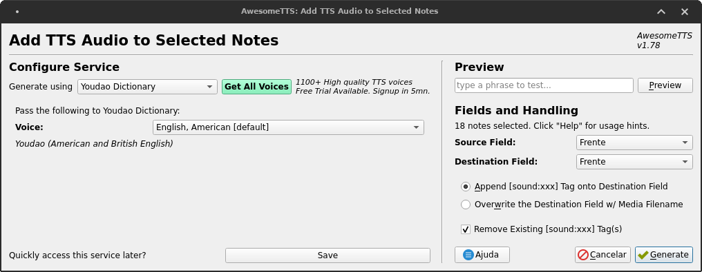

Dependendo da língua você utilizar, você vai ter que testar serviços diferentes. Você pode escolher o serviço utilizando o menu ao lado do campo `Generate using`, na seção `Configure Service`.

Alguns serviços são pagos, outros exigem que você faça um registro. Há, contudo, serviços que não impõem esses incômodos, e estes são os que nós usaremos. O melhor serviço depende da língua que você for utilizar. Para este exemplo consideraremos a língua inglesa, e por isso utilizaremos a opção que eu acho ser a melhor desta lista: o _Youdao Dictionary_. 

Feito essa escolha, escolha a voz desejada. Há duas opções: inglês americano ou britânico. É questão de gosto.

Do lado direito da tela, há a opção de `Preview`, em que você pode testar palavras e frases. Abaixo desta, `Fields and Handling`. `Source Field` é a parte do seu baralho que o serviço selecionado usará como fonte para produzir os sons. `Destination Field` é a parte do seu baralho em que a faixa de áudio produzida vai ser armazenada. 

Se você quiser "adivinhar" ou "lembrar" a pronúncia correta de uma palavra, coloque no `Destination Field` o campo `Verso`. Mas eu não acho que isso é necessário, então por conta disso, para este exemplo, nós colocaremos tanto o `Source Field` quanto o `Destination Field` como `Frente`.

Logo abaixo você verá duas opções: 

1. `Append [sound:xxx] Tag onto Destination Field`
   - Esta função simplesmente adiciona a faixa de som ao `Destination Field`.
2. `Overwrite the Destination Field w/ Media Filename`
   - Esta função apaga o conteúdo do `Destination Field` e coloca a faixa de som no seu lugar.

Escolha a primeira. Se você escolher a segunda, você apagará o conteúdo do campo que está como `Destination Field`, e você provavelmente não quer isso.

Deixe marcada também a caixa "`Remove Existing [sound:xxx] Tag(s)`". Ela faz com que qualquer faixa de som que você tenha adicionado a este campo antes seja substituída pela que você está inserindo agora. Não há razão para desmarcar esta opção, a menos que você tenha anteriormente adicionado alguma outra faixa de som que você queira manter.

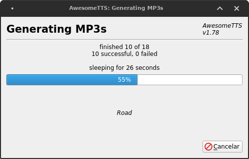

Feito tudo isso, clique em `Generate`. O programa começará a coletar as palavras marcadas e adicioná-las ao campo conforme você configurou. A cada 10 palavras coletadas, o programa fará uma pausa de 30 segundos. O motivo desta pausa é não sobrecarregar o servidor do serviço selecionado (neste caso, o _Youdao Dictionary_). Outros serviços, como o _Google Translate_, impõem uma pausa de 30 segundos _a cada uma_ palavra, motivo pelo qual eu não gosto tanto de utilizá-los. O Yandex também é bom, mas não é o melhor para o inglês.

Se tudo der certo, você verá a seguinte página:

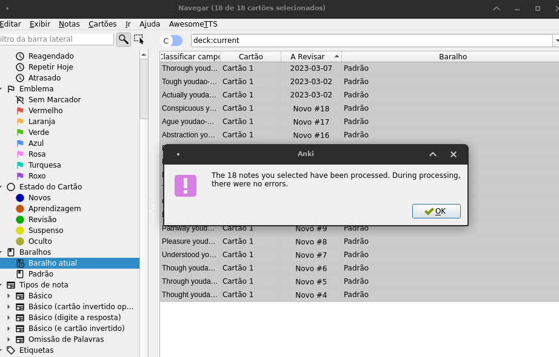

E pronto! Agora suas cartas têm áudio.

No próximo capítulo nós aprenderemos a adicionar diferentes campos ao baralho e a editar a aparência deles. Neste momento o nosso baralho só tem dois campos: `Frente` e `Verso`. Nós adicionaremos os campos `Exemplos`, `Tradução dos exemplos` e `Áudio`.

----

Vimos aqui como utilizar a extensão _AwesomeTTS_ para adicionar som ao Anki. Existem múltiplas outras extensões, umas apenas como valor estético (como o _Minimal Theme_), outras para nos fornecer um panorama geral da nossa frequência de estudo (como o _Review Heatmap_) e ainda há outros que adicionam diferentes funcionalidades ao Anki: memorização de poemas, leitura de PDFs, treinamento para escrita de _Kanji_ para quem está estudando japonês, e muitos outros. Há uma enorme variedade. Caso você tenha alguma demanda que o Anki padrão não cobre, é possível que você encontre uma extensão que serve justamente para ela na página de _plugins_ do Anki.

# Anki: customização de baralhos 

Há certas palavras que possuem muitos significados, e que só o contexto vai poder nos dizer com segurança qual deles deve ser considerado. Há também algumas que talvez possuam um só significado, mas que podem ser especialmente difíceis de memorizar, seja por ser rara, seja por parecer com outras, seja por não se conectar muito bem com o nosso mundo pessoal. 

O aprendizado é facilitado pela conexão entre as ideias. Talvez seja possível afirmar até que não haja aprendizado sem conexão. Quando você consegue conectar um conceito a uma aplicação, não só é mais fácil memorizá-lo, como é possível que você não tenha nem que se preocupar com "decoreba". Quando você gosta de um assunto, aprendê-lo é mais fácil. Uma das explicações para disso é que os conceitos que compõem esse assunto são importantes para a sua vida, então eles estabelecem conexões com áreas do seu interesse. É por isso que é importante criar memórias carregadas de emoção no nosso processo de aprender uma língua.

Estudar com uma pessoa ou em um lugar específico também pode nos ajudar a aprender. A associação não se dá apenas com ideias, mas com pessoas, locais, cheiros, sons e qualquer outro tipo de coisa. Porém, isso pode não ser perfeitamente factível quando estamos querendo aprender uma língua. Talvez não conheçamos outras pessoas que querem aprendê-la conosco, ou não temos (ou podemos ter) um lugar específico para nos dirigirmos só para estudá-la.

A proposição continua de pé, entretanto: quanto mais conexões conseguimos fazer entre as informações, mais fácil se torna o processo de aprendê-las. Um flashcard que contenha apenas uma palavra na `Frente` e a sua tradução no `Verso` não é algo muito estimulante. Com frequência vai ser algo pouco memorável, podendo ser chato, e facilmente esquecível. É preciso então considerar como incluir mais informação nesse baralho.

É claro, podemos simplesmente ir inserindo informação nos campos de `Frente` e `Verso` na hora de criarmos as nossas cartas, mas isso pode facilmente virar uma bagunça. Uma forma de evitarmos esse tipo de confusão é criar novos campos para as nossas cartas. Para não alterar de forma indesejável as cartas que já existem, vamos criar um tipo novo de carta.

## Criando diferentes tipos de notas

A primeira coisa que deve ser feita é abrir o menu de edição de notas, sinalizado pelo título "Gerenciar Tipos de Notas":


Você será recebido com um menu que contém diferentes opções e que expõe quais tipos de cartas já estão disponíveis. Você provavelmente verá os seguintes tipos:
- Básico
- Básico (cartão invertido opcional)
- Básico (digite a resposta)
- Básico (e cartão invertido)
- Omissão de palavras

Se você tiver baixado algum baralho no _AnkiWeb Shared Decks_, você provavelmente verá um ou mais tipos diferentes nesta lista. No lado direito, cliquemos em `Adicionar`.

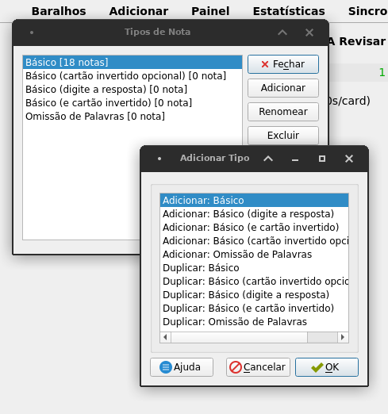

Escolha "Adicionar: Básico". O programa pedirá que você escolha um nome. Aqui eu colocarei o nome de "Básico com exemplos". Sugiro que você faça o mesmo, pelo menos ao longo dessas instruções. Feito isso, você verá um novo tipo de carta aparecer na lista. Selecione o tipo recém-criado e depois clique em `Campos`.

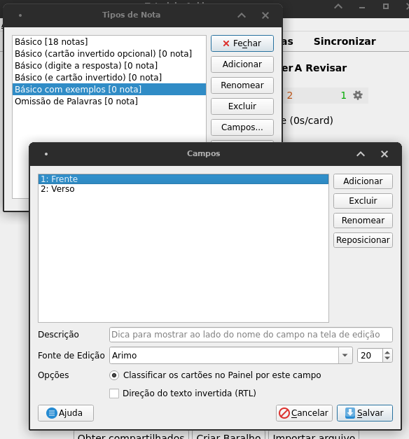

Você perceberá que tal como antes esse tipo de cartão só tem os mesmos dois campos de antes: `Frente` e `Verso`. Agora nós vamos criar nos campos.

Clique em adicionar e, um de cada vez, crie os seguintes campos (sem as aspas):
- "Exemplo"
- "Tradução do exemplo"
- "Áudio"

O nome que você coloca fará diferença daqui a pouco, portanto seja consistente. Se você for colocar nomes diferentes, ou se for colocar tudo em maiúsculo, ou tudo em minúsculo, ou se vai capitalizar as iniciais de cada palavra, tenha isso em mente. Você deve ter a seguinte tela como resultado:

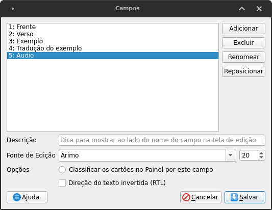

Clique em `Salvar` e _voilà_, você criou novos campos para esse tipo de _flashcard_. 

Por ora, entretanto, isso não vai mudar nada nas nossas vidas. Nós criamos novos possíveis campos para o nosso "Tipo de carta" que nomeamos "Básico com exemplos". Agora precisamos adicionar estes campos ao cartão.

## Editando 

Para fazer essa adição, ainda selecionado o nosso tipo de cartão recém criado ("Básico com exemplos"), clique em `Cartões`. Você verá algo parecido com a seguinte tela:

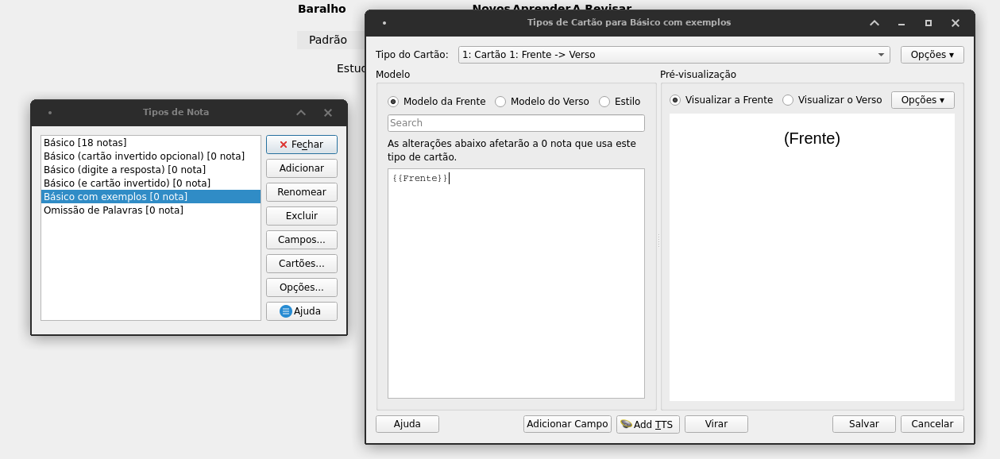

Esse é um modelo desse tipo de _flashcard_. Ele serve de molde para todos os cartões desse tipo que você criar. 

Do lado esquerdo dessa tela, você verá as opções `Modelo da Frente` e `Modelo do Verso`. No lado esquerdo você verá também um campo para digitação em que está escrito "{{Frente}}". Tudo o que você elaborar neste campo comporá a parte da `Frente` do seu cartão. Se ao lado do "{{Frente}}" eu inserir os caracteres "-------- exemplo", eles serão renderizados ao lado. Veja:

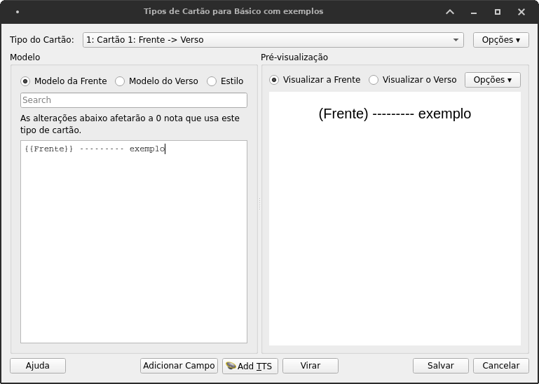

Mas do que vale esses dizeres, "{{Frente}}"? Tudo o que fizer parte do seu campo da `Frente` aparecerá aí. Por exemplo, se eu tenho um _flashcard_ cuja `Frente` é "Alright", se neste modelo estiver escrito "{{Frente}} --------- exemplo", na hora do meu estudo eu verei "Alright ----------- exemplo".

O que quer dizer que o que eu colocar no campo "{{Exemplo}}" (entre colchetes) aparecerá no mesmo lugar na hora do estudo. Vamos editar o campo da frente, então, para deixá-lo da seguinte forma:

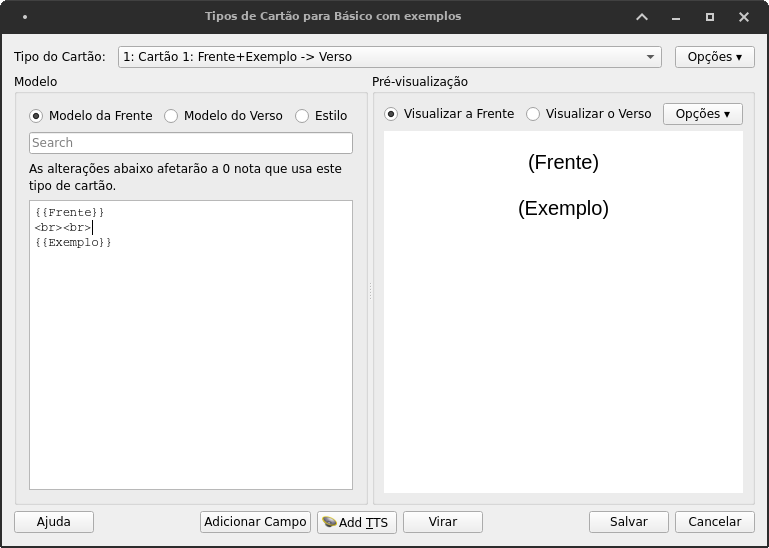

Os nomes para os campos que criamos em [Criando diferentes tipos de notas] são os nomes que precisamos considerar aqui. Se inserirmos um nome que não definirmos previamente, seremos recebidos com um erro do lado. Por exemplo, se o campo que tivermos criado no menu `Campos` tiver sido "Exemplo" mas aqui escrevermos "Exemplos", no plural, o programa não entenderá o que você quer dizer e apresentará um erro. É necessário ser exato e colocar aqui exatamente o que você inseriu no menu `Campos`.

Você pode estar estranhando por que nós inserimos esses "\<br\>\<br\>" entre "{{Frente}}" e "{{Exemplo}}". Essas são _tags_ HTML. Não nos aprofundaremos nisso, mas nós iremos abordá-las brevemente na última seção deste capítulo, caso você queira se familiarizar mais com as possibilidades deste menu. Em essência, entretanto, essas _tags_ "\<br\>\<br\>" servem para pular a linha, para que o conteúdo dos campos "{{Frente}}" e "{{Exemplo}}" não fique na mesma linha.

Vamos fazer o seguinte. Vamos inserir também o campo "{{Áudio}}" nessa mesma parte do flashcard, logo acima do campo "{{Frente}}":

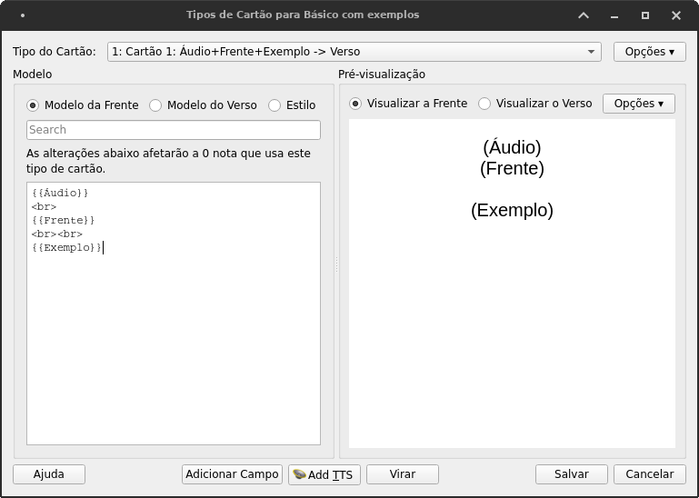

O motivo de só termos inserido apenas uma tag "\<br\>" agora é puramente estético. Feito isso, a parte da frente do nosso cartão está pronta. Clique agora em `Modelo do Verso`.

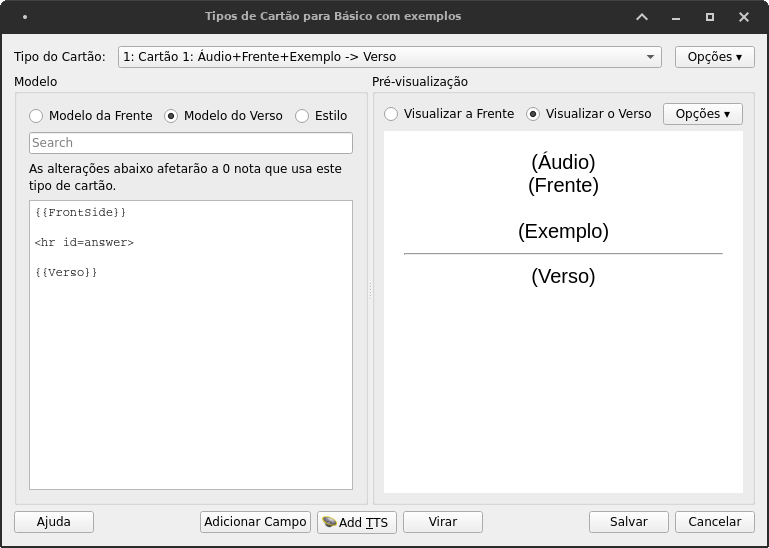

Você deve ver, do lado direito, uma cópia do que você criou na parte anterior deste menu, adicionada de uma linha que a separa na metade e o campo "{{Verso}}". Do lado esquerdo, há o campo "{{FrontSide}}", que representa o lado da `Frente` que você editou anteriormente, com todas as coisas que você acrescentou, incluindo os campos "{{Áudio}}", "{{Frente}}", "{{Exemplo}}" e as tags HTML para pular de linha.^[Atenção! o campo "{{FrontSide}}" não representa apenas o campo da "{{Frente}}", mas todo o _lado_ da frente do seu flashcard, contendo todos os campos que você inseriu no lado da frente, não apenas o campo que tem esse mesmo nome.]

Vamos agora fazer uma breve edição: vamos apenas adicionar o campo "{{Tradução do exemplo}}" ao `Modelo do Verso`, da seguinte forma:

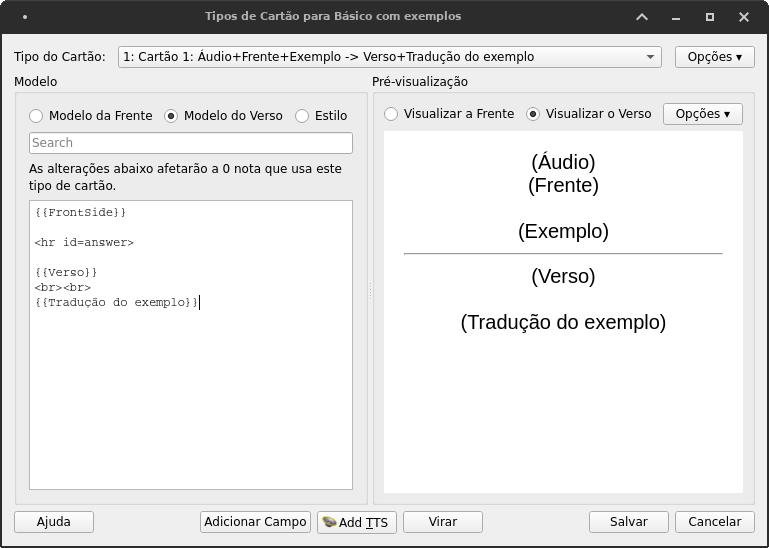

Feito isso, podemos clicar em `Salvar`, no campo inferior direito deste menu. A seção `Estilo` nós veremos na última parte deste capítulo, logo após abordarmos a interação desta funcionalidade com as planilhas.

Estaremos de volta ao menu dos `Tipos de Nota`. Fechemos este menu também. Agora vamos clicar em `Adicionar` para inserir cartas novas como vimos no capítulo [Anki: primeiros passos]. Precisamos alterar o tipo de cartas que estamos utilizando. Clique em `Tipo` e selecione o `Tipo` que criamos anteriormente:

 

Você verá agora uma multiplicidade de campos. Podemos então preenchê-los da seguinte forma, por exemplo:

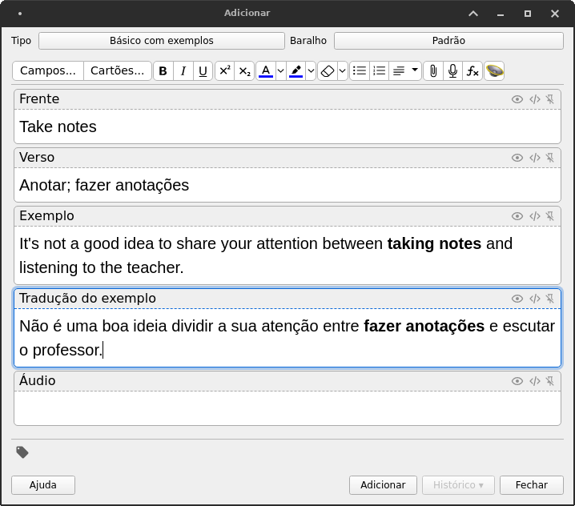

Vou deixar o campo de `Áudio` vazio de propósito neste momento. Tal como no [capítulo anterior][Anki: plugins e AwesomeTTS], nós podemos acrescentar áudio a este campo com base no conteúdo de outros campos:


Ao estudarmos os nossos cartões, veremos o cartão que criamos da seguinte forma:

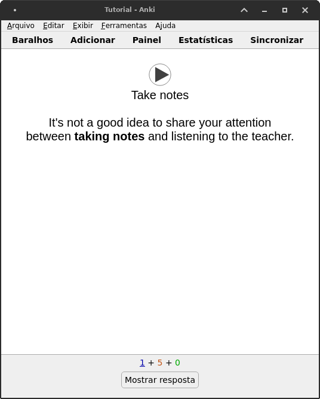

Ao clicarmos para ver o `Verso` da carta, veremos também o campo "{{Tradução do exemplo}}":

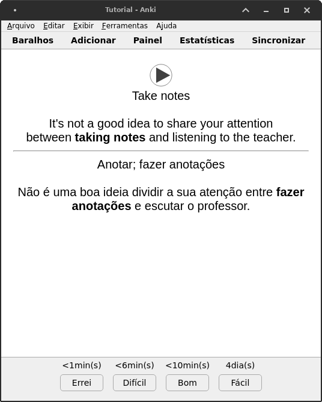

Está feito! A inserção de diferentes campos pode nos ajudar a colocar informações diferentes, conforme nosso desejo e necessidade e de forma organizada, nos nossos cartões. Pode-se adicionar diferentes campos, por exemplo, um para imagens, outro para classe gramatical... Enfim! Aqui, as diretrizes são a necessidade e a criatividade.

Mas dito isso, pode ser útil considerar como podemos organizar planilhas para criar cartas com esses múltiplos novos campos. Veremos isso agora.

## Usando planilhas para criar cartas com múltiplos campos

A princípio, a ordem dos campos (definida no menu `Campos` na hora de criá-los) é a ordem das colunas da planilha, da seguinte forma: 


Assim, basta organizarmos a ordem das colunas para que correspondam à ordem dos campos que criamos e populá-las de acordo -- lembrando que costuma ser mais eficiente deixarmos para popular os campos de áudio usando o AwesomeTTS em vez de tentarmos preenchê-lo manualmente. Feito isso, basta salvarmos em formato .csv em importar normalmente como faríamos.

Contudo, caso tenhamos mudado a ordem de alguma coisa (seja a ordem dos nosso campos no menu `Campos`, seja a ordem dos conteúdos nas colunas) nós podemos remediar essa situação na hora de importar o conteúdo da planilha para o nosso baralho. Basta parearmos a ordem da planilha com o dos campos na hora da importação:


 E está feito.

 ---

Não precisaremos saber de mais do que isso para estudarmos e elaborarmos material de estudo no Anki. Verdadeiramente, esse é o essencial. Contudo, o Anki pode ter uma aparência um tanto simples. Além disso, pelas planilhas nós não podemos fazer edições na aparência do conteúdo das nossas cartas -- caso queiramos, por exemplo, deixar uma palavra ou outra em negrito.

Podemos deixar as nossas cartas mais atraentes ou mais didáticas utilizando HTML e CSS. O resultado aqui é puramente estético, mas pode valer a pena deixar as cartas que vamos estudar por meses a fio um pouco mais agradáveis de se olhar.

Contudo, HTML e CSS são um assunto bem técnico e especializado -- sendo sobretudo parte da ocupação de desenvolvedores e designers de websites. Não entraremos a fundo -- apenas veremos o básico do básico, para termos noção do que é possível. Caso você queira se aprofundar neste tema, há múltiplos recursos. Um que eu recomendo é a trilha de HTML e CSS do [Khan Academy](https://pt.khanacademy.org/computing/computer-programming/html-css).

## HTML e CSS

Esta seção é puramente técnica e estética. Se você não aguenta mais ficar olhando para a tela branca do seu baralho do Anki, você pode usar o conteúdo que você vai aprender aqui Se editar mexer com código de computador te causa ansiedade, saiba que deixar esse capítulo de lado não vai impedir você de aproveitar este método. Dito isso, se você seguir adiante e lê-lo, perceberá que não é tão difícil quanto parece.

### HTML no conteúdo das cartas 
Como é que o Anki faz com que certas palavras ou frases fiquem em negrito, itálico ou colorido? Ele usa HTML.


Se você for no menu `Painel`, você pode visualizar uma das suas cartas que têm algum caractere em negrito. Exemplo: 

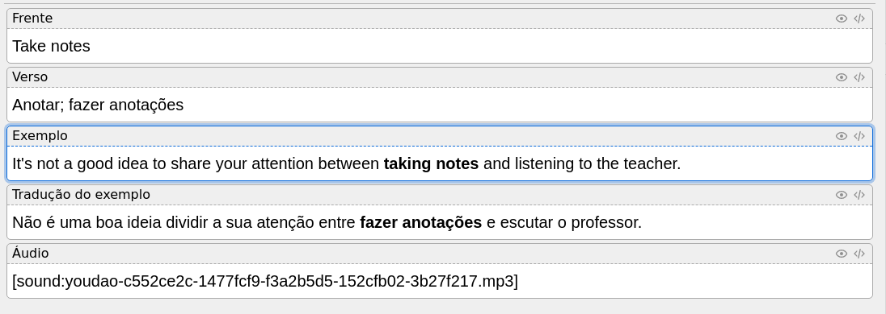

No canto superior direito de cada um desses campos, você tem um símbolo que parece com um olho, e logo ao lado um símbolo que representa o código em HTML utilizado para renderizar o texto dessa forma ("</>"). Clicando nele, você pode ver o HTML que faz parte desse texto:

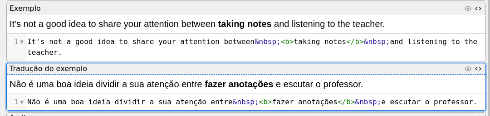

O código HTML presente ali é este:

```{html}
nbsp;<b>taking notes</b>nbsp;
```

A parte que nos é de interesse é especialmente a da tag `<b></b>`. A primeira parte desse código (`<b>`) abre a função "negrito" (o "b" representa "bold", inglês para "negrito"), e a segunda (`</b>`) a fecha. Qualquer palavra ou conjunto de palavras entre essas duas partes será renderizada em negrito. Toda tag HTML é composta de `<>` e é fechada com `</>`. Assim, nós temos:

- `<b>` e `</b>`, para deixar o texto em **negrito**;
- `<i>` e `</i>` para deixar o texto em _itálico_
- `<div>` e `</div>` para criar divisórias na página.

E assim por diante. É aqui que entra o valor da função `Permitir HTML em campos` na janela de importação do Anki: como você não pode importar texto em negrito das planilhas, você precisa incluir as tags HTML nelas caso você deseje que elas fiquem em negrito, itálico ou de algum outro modo editadas. Por exemplo:

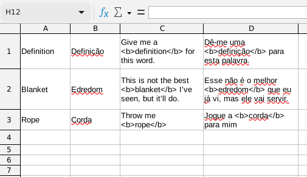

Porém não é apenas o conteúdo do texto que pode ser editado usando HTML. Você pode editar a própria aparência da carta utilizando-o.

### HTML na estrutura das cartas

Vamos voltar ao campo `Cartões` do menu de edição do tipo de nota. Selecione o `Tipo` "Básico com Exemplos" e clique em `Cartões`. Você será recebido com o modelo de carta que criamos anteriormente. 

Eis o que faremos com essas cartas:
- Alteraremos a cor do plano de fundo para algo menos intenso que esse branco (talvez um amarelo-palha, talvez um azul claro);
- Colocaremos os campos "{{Exemplo}}" e "{{Tradução do exemplo}}" em uma caixa separada, mais escura, e mudaremos a cor da fonte para uma cor mais clara. 

Mãos à obra.

#### Alteração do plano de fundo

Clique em `Estilo`. Você está vendo um pedaço de código CSS.

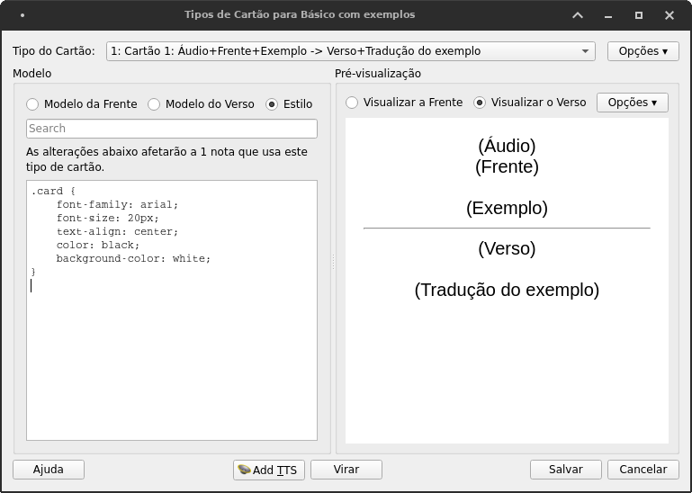

Eis o que esse código significa:

- **.card**: o objeto a ser editado faz parte da classe "card". Essa classe foi definida pelo próprio Anki. Os colchetes abertos dizem que os próximos comandos são referentes à edição deste objeto.
- **font-family**: define que a fonte a ser utilizada deve ser "arial". O ponto e vírgula (`;`) encerra a edição desta propriedade para que possamos editar a próxima. _É necessário encerrar toda e qualquer edição de propriedades CSS com ponto e vírgula_.
- **font-size**: define que o tamanho da fonte deve ser de 20px (ou "20 pixels").
- **text-align**: define que o texto deve ser centralizado. Ele poderia estar alinhado à esquerda ou à direita, mas ele está centralizado.
- **color**: define que a cor do texto deve ser preto.
- **background-color**: define que a cor do plano de fundo deve ser branco. Nós editaremos esse primeiro.

Mas que cor usaremos? Se escrevermos "yellow" no lugar de "white" vai funcionar muito bem, mas ficará simplesmente horrível. Vamos, faça o teste.

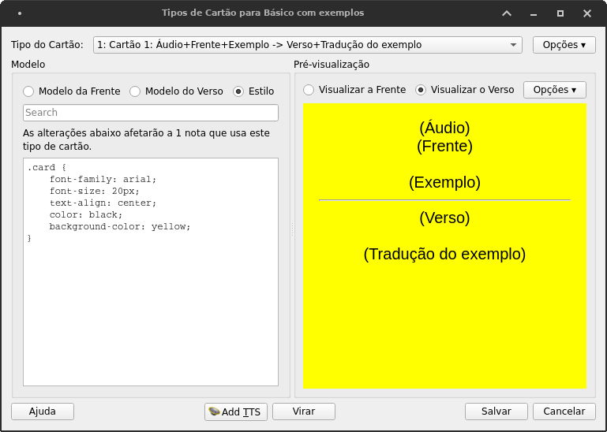

O que nós precisamos fazer é usar um _código hexadecimal_ para colocar a cor que desejamos. Isso pode ser feito facilmente utilizando o _Colour Picker_ do Google. Se você pesquiasr "Colour Picker" no Google você será recebido com esse painel:

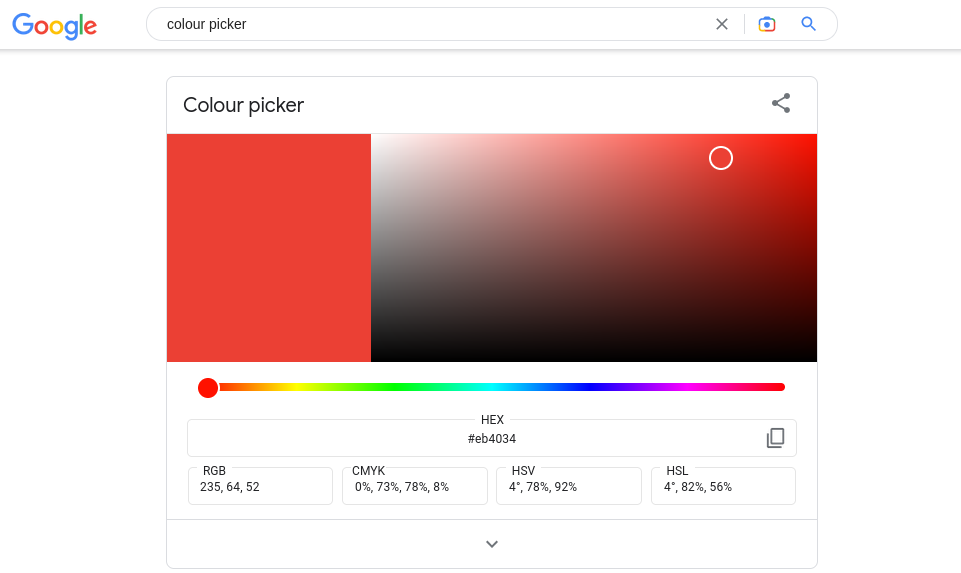

Depois de selecionar uma cor que te agrada, copie o código hexadecimal gerado e cole-o no lugar da propriedade `background-color`. Eu escolhi o código `#f0eac2`, que é um amarelo bem claro. Se você estiver interessado em entender melhor como esses códigos de cores funcionam, talvez você precise se aprofundar um pouco mais em HTML e CSS do que compete o escopo desse site, e para isso eu recomendo o [Khan Academy](https://pt.khanacademy.org/computing/computer-programming/html-css).

Sigamos em frente.

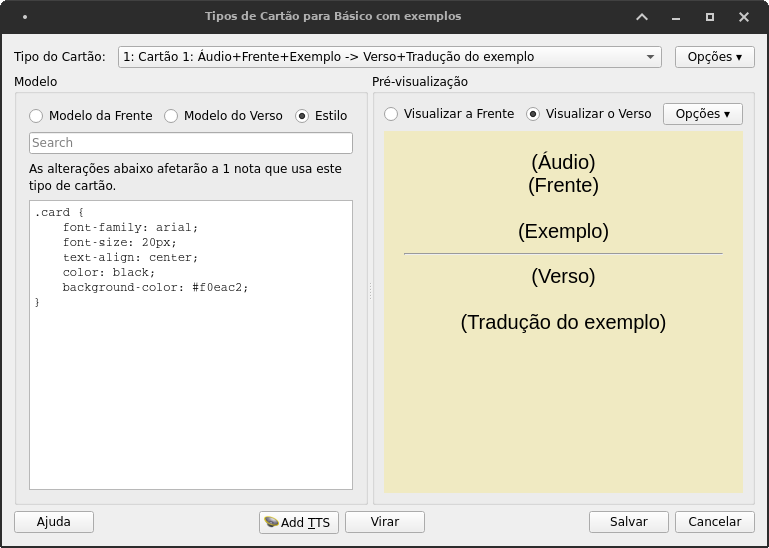

Depois de editar a cor do plano de fundo, nós vamos agora envolver os nosso campos "{{Exemplo}}" e "{{Tradução do exemplo}}" em uma divisória mais escura, apenas para separá-la do resto da carta. Para isso, precisamos voltar na seção `Modelo da Frente` e fazer uma pequena edição. No campo de edição do `Modelo da Frente` você deve ter um código mais ou menos assim, se você seguiu as edições que fizemos nas seções anteriores desta capítulo:

```{html}
{{Áudio}}
<br>
{{Frente}}
<br><br>
{{Exemplo}}
```

O que nós vamos fazer é criar uma tag `<div>` (que cria uma "divisória") ao redor do {{Exemplo}} e atribuir a ela uma classe chamada "exemplos":

```{html}
{{Áudio}}
<br>
{{Frente}}
<br><br>
<div class="exemplos">
	{{Exemplo}}
</div>
```

Essa propriedade `class` (classe) serve para que possamos editar todos os objetos que tenham essa mesma classe de uma vez só, sem precisarmos editar um por um. Esse mesmo tipo de edição deve ser feito no `Modelo do Verso`, deixando-o assim:

```{html} 
{{FrontSide}}

<hr id=answer>

{{Verso}}
<br><br>
<div class="exemplos">
	{{Tradução do exemplo}}
</div>
```

Circundamos o `Campo` "{{Tradução do exemplo}}" com a tag `<div>`, que tem a `class` "exemplos".

Agora nós editaremos os dois campos de uma só vez. Se nós formos agora para a seção `Estilo` podemos acrescentar o seguinte código ao campo de edição:

```{css}
.exemplos {
	background-color: #21212166;
	width: 80%;
	margin: auto;
	padding: 7px;
	border-radius: 5px;
	text-align: left;
	color: #fafafa;
	font-size: 16px;
}
```

Assim, tanto {{Exemplo}} quanto a {{Tradução do exemplo}} ficarão semelhantes entre si e diferentes do resto do conteúdo. Não copie e cole: vá fazendo essas edições uma a uma, e você entenderá o que cada uma dessas linhas quer dizer. Dito isso, vamos desmembrá-las:

- **background-color**: como vimos anteriormente, altera a cor do plano de fundo. Eu escolhi `#21212166`, que é um cinza escuro com um pouco de transparência.
- **width**: É a largura da divisória. Escolhi "80%" para fazer com que essa divisória ocupe 80% da página.
- **margin**: é a distância que a divisória tem das margens da página. O valor `auto` representa "automático", que por padrão coloca a divisória no meio da página.
- **padding**: dá uma "inchada" na divisória, para que ela dê espaço para que o texto respire.
- **border-radius**: é o "raio da borda", ou seja, o quanto as quatro pontas da divisória são curvas.
- **text-align**: alinha o texto em alguma direção. O padrão do Anki é "center", o que resulta em texto centralizado. Quis alinhar à esquerda os exemplos para diferenciá-los, então dei o valor "left".
- **color**: muda a cor _do texto_. O valor `#fafafa` é um cinza bem claro, quase branco.
- **font-size**: define o tamanho do texto dos exemplos dentro da divisória. Escolhi 16px (16 pixels) porque queria que esse texto fosse menor do que os da {{Frente}} e do {{Verso}}. 

O resultado é este:

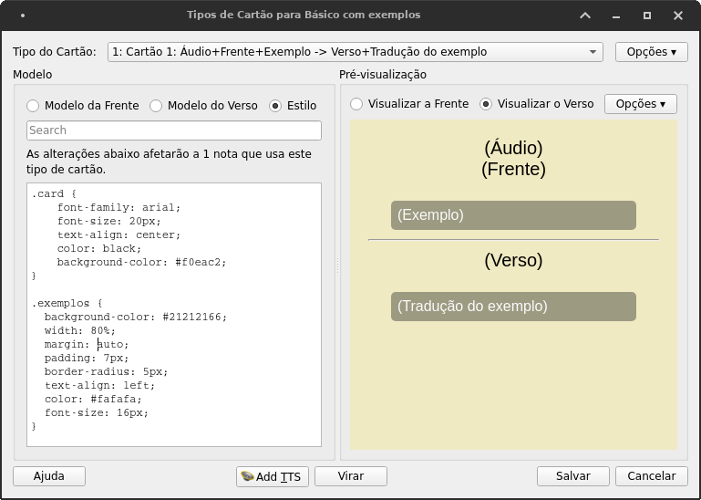

Que ao salvarmos (clicando em `Salvar`) e vermos sendo utilizado de fato em uma das notas que criamos, resultará nessa forma de representar nossos _flashcards_:


E claro, a forma como fazer isso é questão de gosto. Você pode preferir outras cores, ou mudar a ordem dos elementos, ou deixar uma coisa maior do que a outra, ou o que quer que seja. O que importa é que você saiba que, caso você queira, você pode editar a aparência das suas cartas para a forma que você quiser.

# Anki: conclusão

Nós acabamos de ver um bocado a respeito do Anki. Para a maioria, apenas o primeir o e talvez o segundo capítulo seriam verdadeiramente necessários. A minha intenção aqui foi fornecer uma visão completa do Anki -- mas não exaustiva. Nós não vimos _tudo_  do que o Anki é capaz, nem editamos cada uma das configurações que são passíveis de serem editadas. Se fizéssemos isso, ficaríamos horas e horas e horas aqui, e seria maçante. Portanto, caso seja do seu interesse, você tem mais do que o necessário aqui para explorar por conta própria as funcionalidades deste programa.

No próximo capítulo nós abordaremos qual é o papel do Anki em relação à imersão. Sabemos que ele é útil, e entretanto também sabemos que ele pode até mesmo ser prescindível. Logo, nós abordaremos no próximo capítulo qual é o verdadeiro lugar dele no aprendizado de línguas.
